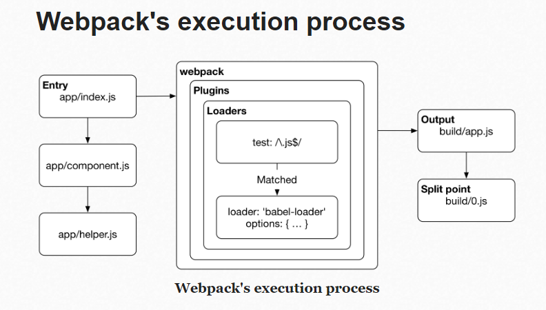

* Internally webpack manages the bundling process using what's called chunk
    Chunks are smaller pieces of code that are included in the bundles seen in webpack output
* 
* Each loader applies a specific transformation against the module contents.
* webpack tries to match the module against the file system using resolve configuration, if resolve fails webpack thorws a runtime error.
* Loaders have resolve conifgurations of their own
* Webpack uses enhanced-resolve package  underneath for resolving modules
* Webpack assumes all code as JavaScript by default.
* entry can be a function and even an asynchronous one 
* webpack-cli comes with additional functionality, including init and migrate
* mini-html-webpack-plugin can be used to create a index.html to output automatically, this gives basic usage for any advanced usage use html-webpack-plugin
* In addition to a configuration object, webpack accepts an array of configurations. You can also return a Promise that eventually resolves to a configuration. Latter is useful if you are fetching configuration related data from a third-party source
* webpack --watch allows recompling of source files but does nothing on th front end site and browser updates
* webpack-dev-server is the officially maintained dev server running **in-memory** (write to RAM instead of files)
* `devServer.historyApiFallback` should be set if you rely on HTML5 History API based routing
* `devServer.contentBase` - Assuming you don't generate index.html dynamically and prefer to maintain it yourself in a specific directory, you need to point WDS to it
* `devServer.proxy` - If you are using multiple servers, you have to proxy WDS to them
* `devServer.headers` - Attach custom headers to your requests here
* `webpack-plugin-serve` (WPS) is a third-party plugin that wraps the logic required to update the browser into a webpack plugin
* To integrate with another server, it's possible to emit files from WDS to the file system by setting `devServer.writeToDisk` property to true
* `webpack-plugin-serve` wraps the logic required to update the browser insto a webpack plugin.
## Notes from wbepack.js.org

* Out of the box, webpack only understands JavaScript and JSON files. Loaders allow webpack to process other types of files and convert them into valid modules that can be consumed by your application and added to the dependency graph
* While loaders are used to transform certain types of modules, plugins can be leveraged to perform a wider range of tasks like bundle optimization, asset management and injection of environment variables
* Since you can use a plugin multiple times in a configuration for different purposes, you need to create an instance of it by calling it with the new operator.
* `Usage: entry: string | [string]`
```js module.exports = {
  output: {
    filename: '[name].[contenthash].bundle.js',
  },
};
```
* use the splitChunks option to create separate chunk for vendor files, do not use entry for vendors that is not the starting point of execution
* As a rule of thumb: Use exactly one entry point for each HTML document. See the issue described here for more details.
```js
  module.exports = {
  entry: {
    app: './src/app.js',
    search: './src/search.js',
  },
  output: {
    filename: '[name].js',
    path: __dirname + '/dist',
  },
};
    // writes to disk: ./dist/app.js, ./dist/search.js
```

* Loaders are evaluated/executed from right to left (or from bottom to top).
* The application shell defines commonly used libraries as shared modules to avoid duplication of them in the page builds
* Custom parameters can be passed to webpack by adding two dashes between the npm run build command and your parameters, e.g. `npm run build -- --color`.
* The `optimization.splitChunks.minSize` option can be used to change the size threshold for creating a chunk, which defaults to 30k.
* `runtimeChunk: "single"` is required to ensure correct module instantiation, it is disabled by default,
* webpack-dev-server doesn't write any output files after compiling. Instead, it keeps bundle files in memory and serves them as if they were real files mounted at the server's root path. If your page expects to find the bundle files on a different path, you can change this with the devMiddleware.publicPath option in the dev server's configuration
* webpack-dev-middleware is a wrapper that will emit files processed by webpack to a server
* Prevent Duplication: Use Entry dependencies or SplitChunksPlugin to dedupe and split chunks.